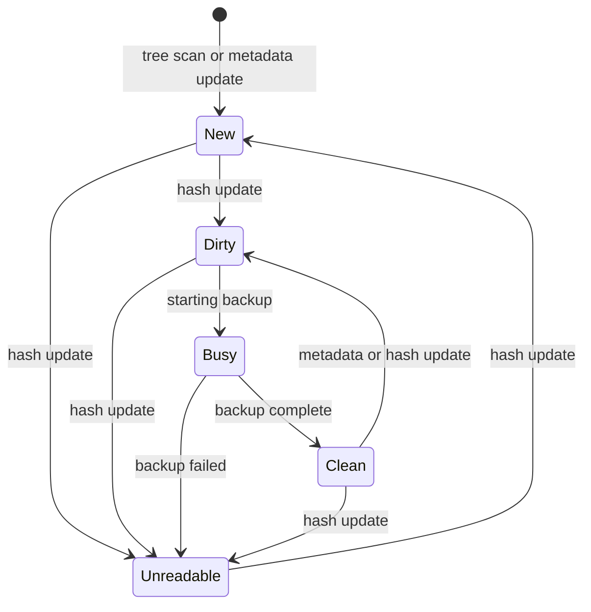

# File states

- New: files freshly discovered, not yet assigned an encryption group.
- Dirty: files that need a backup attempt.
- Busy: files actively being backed up.
- Clean: files that have been backed up and haven't changed since.
- Unreadable: files that can't be read.

# Scanning

File scanning uses two modes to keep up with changes:

- time based: periodic search for changes across all files.
- watcher based: immediate reaction on filesystem changes reported by the OS.

## Time-based

Starting from "roots" which are provided by the user, the file manager checks
all reachable files (not following symlinks) on a regular basis.

Once a file is detected, it carries its own time-to-next-action, which will
ensure changes always get enventually detected.

## Watcher-based

When the OS detects file changes under the roots, the scanner will do a fast
check about the file's metadata (size, modification time) to decide if a
state change is warranted.

# Delays

While we generally want to react quickly, there are still things we want to
postpone:

- running a backup while a file is actively modified: similar to "debouncing"
  we want to wait for the file to be stable.
- for files frequently modified, we also want to limit the number of backups
  independently of debouncing.

TODO: Handling of dropped roots: Crashplan deletes data right away.
      I don't like this as the default, maybe just a future improvement
      to do *explicit* garbage collection, triggered by the source.

TODO: How do "directory moves" get represented by notify? 
      I need to propagate to all children, incl. keeping FileId.
      Hard to avoid recursive updates in that case, but still rare
      and cheaper than having to re-hash everything to figure out
      identities.

